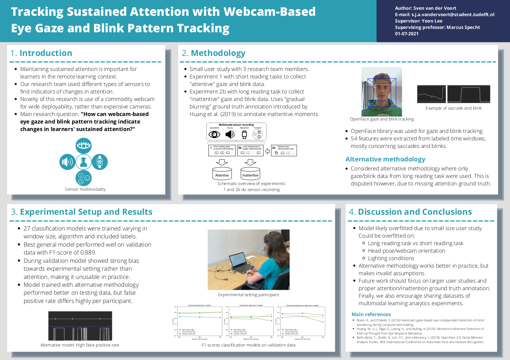

# Tracking Sustained Attention with Webcam-Based Eye Gaze and Blink Pattern Tracking

This repository contains all source code and datasets specific to the Research Project "Tracking Sustained Attention with Webcam-Based Eye Gaze and Blink Pattern Tracking".
It is part of a the Research Group "Multimodal Learning Analytics", consisting of four BSc students with each an individual research paper.
All source code and data that is common to the four projects can be found in [the common repository](https://github.com/MultimodalLearningAnalytics/rp-group-19-common).

This repository contains two folders. Each folder contains a README.md with details about its contents.

- The folder `data` contains all datasets, derived analytics and models created and/or generated for the eye gaze and blink tracking project.
- The folder `software` contains programs in several programming languages (C#, C++, Python and Java) that were used for post-processed, aggregating and analyzing the data and models.

Details about the research can be found in the paper: [Tracking Sustained Attention with Webcam-Based Eye Gaze and Blink Pattern Tracking](https://repository.tudelft.nl/islandora/object/uuid:56ff42f2-2538-49e1-b022-894b15c7956d).

In case of questions please reach out through GitHub.

